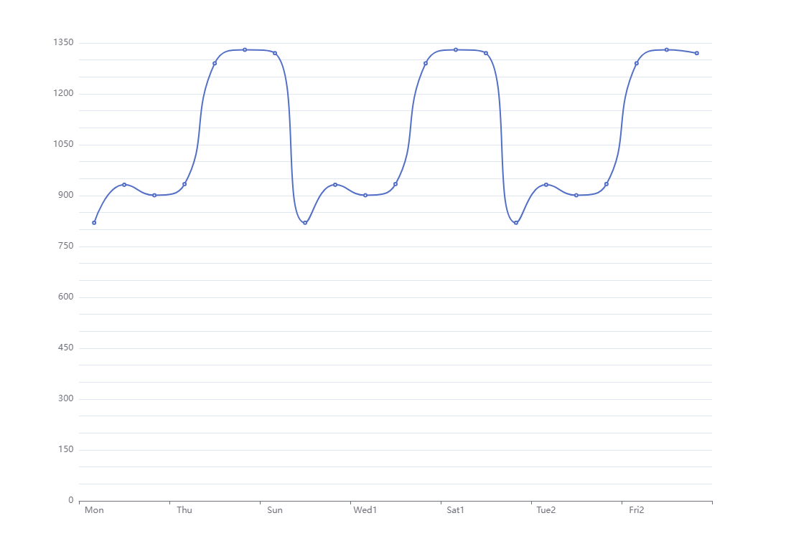

## echarts图形的x、y坐标文字设置间隔显示

```
option = {
    xAxis: {
        type: 'category',
        data: ['Mon', 'Tue', 'Wed', 'Thu', 'Fri', 'Sat', 'Sun',
        'Mon1', 'Tue1', 'Wed1', 'Thu1', 'Fri1', 'Sat1', 'Sun1',
        'Mon2', 'Tue2', 'Wed2', 'Thu2', 'Fri2', 'Sat2', 'Sun2'],
        axisLabel:{
            interval:2 //interval只对category有用
        }
    },
    yAxis: {
        type: 'value',
        splitNumber: 24,
        //inverse: true,//顺序不变（在xy互换时候常用）
        axisLabel:{
            formatter: (val,key)=>{
                if(key%3 == 0 ){
                    return val
                }
                
            }
        }
    },
    series: [{
        data: [820, 932, 901, 934, 1290, 1330, 1320, 820, 932, 901,
        934, 1290, 1330, 1320, 820, 932, 901, 934, 1290, 1330, 1320],
        type: 'line',
        smooth: true
    }]
};

```