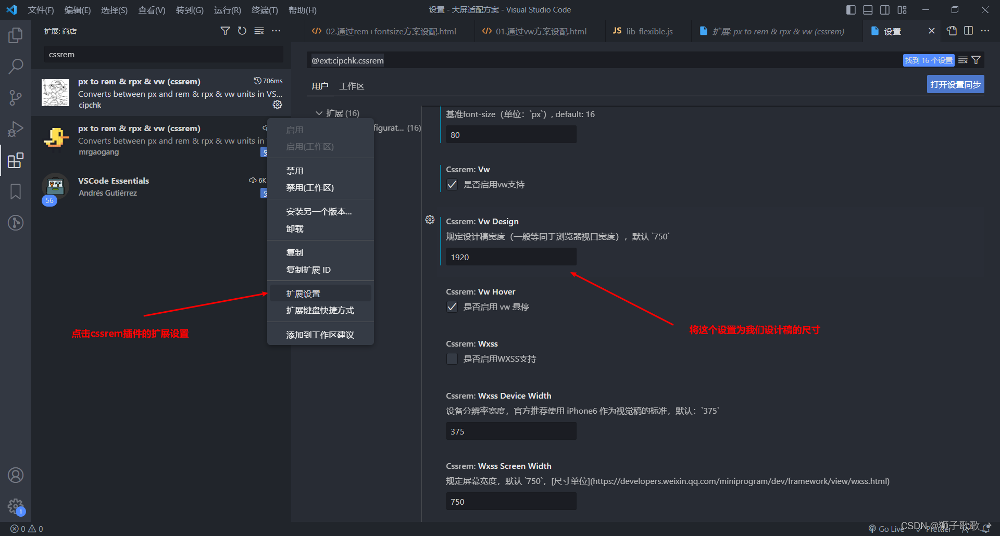

# 自适应开发

## css单位了解

px：像素 相对长度单位，相对于显示器屏幕分辨率(推荐使用)  
em：相对长度单位 基准点为父节点字体的大小，如果自身定义了font-size按自身来计算（浏览器默认字体是16px），整个页面内1em不是一个固定的值。  
rem：相对单位 可理解为”root em”, 相对根节点html的字体大小来计算，CSS3新加属性，chrome/firefox/IE9+支持。  
vw：viewpoint width，视窗宽度，1vw等于视窗宽度的1%。  
vh：viewpoint height，视窗高度，1vh等于视窗高度的1%。  
vmin：vw和vh中较小的那个。  
vmax：vw和vh中较大的那个。  
%:百分比  
in:寸  
cm:厘米  
mm:毫米  
pt:point，大约1/72寸  
pc:pica，大约6pt，1/6寸  

## 前端自适应开发常用方法

### rem+font-size

动态设置HTML根字体大小和body字体大小，会使用到lib-flexible.js插件（地址https://github.com/amfe/lib-flexible/blob/2.0/index.js）
使用插件 px to rem(cssrem)来协助展示转换
```
<!DOCTYPE html>
<html lang="en">
  <head>
    <meta charset="UTF-8" />
    <meta http-equiv="X-UA-Compatible" content="IE=edge" />
    <meta name="viewport" content="width=device-width, initial-scale=1.0" />
    <title>Document</title>
    <style>
      * {
        margin: 0;
        padding: 0;
      }
      body {
        width: 24rem;
        height: 13.5rem;
        border: 3px solid red;
        box-sizing: border-box;
      }
      ul {
        display: flex;
        flex-direction: row;
        flex-wrap: wrap;
        width: 100%;
        height: 100%;
      }
 
      li {
        width: 33.333%;
        height: 50%;
        font-size: 0.375rem;
        list-style: none;
        border: 3px solid green;
        box-sizing: border-box;
      }
    </style>
  </head>
  <body>
    <ul>
      <li>1</li>
      <li>2</li>
      <li>3</li>
      <li>4</li>
      <li>5</li>
      <li>6</li>
    </ul>
  </body>
  <script src="./js/lib-flexible.js"></script>
</html>
```
```
(function flexible (window, document) {
    var docEl = document.documentElement
    var dpr = window.devicePixelRatio || 1
  
    // adjust body font size
    function setBodyFontSize () {
      if (document.body) {
        document.body.style.fontSize = (16 * dpr) + 'px'  //字体设置为16
      }
      else {
        document.addEventListener('DOMContentLoaded', setBodyFontSize)
      }
    }
    setBodyFontSize();
  
    // set 1rem = viewWidth / 24 将1920设置为24份
    function setRemUnit () {
      var rem = docEl.clientWidth / 24
      docEl.style.fontSize = rem + 'px'
    }
  
    setRemUnit()
  
    // reset rem unit on page resize
    window.addEventListener('resize', setRemUnit)
    window.addEventListener('pageshow', function (e) {
      if (e.persisted) {
        setRemUnit()
      }
    })
  
    // detect 0.5px supports
    if (dpr >= 2) {
      var fakeBody = document.createElement('body')
      var testElement = document.createElement('div')
      testElement.style.border = '.5px solid transparent'
      fakeBody.appendChild(testElement)
      docEl.appendChild(fakeBody)
      if (testElement.offsetHeight === 1) {
        docEl.classList.add('hairlines')
      }
      docEl.removeChild(fakeBody)
    }
  }(window, document))
```
7680*2160 超宽屏下无法全部显示 可以使用下面的方法

### scale方法
```
setScale() {
  let designWidth = 1920;
  let designHeight = 1080;
  let scale =
    document.documentElement.clientWidth /
      document.documentElement.clientHeight <
    designWidth / designHeight
      ? document.documentElement.clientWidth / clientWidth
      : document.documentElement.clientHeight / clientHeight;  //这个地方取高还是取宽根据自己的情况定
  document.querySelector(
    "#screen"
  ).style.transform = `scale(${scale}) translate(-50%)`;
}

//或者是 完全压缩 
getScale() {
   const w = window.innerWidth / this.style.width;
   const h = window.innerHeight / this.style.height;
   return {x:w,y:h};
},
setScale() {
   let scale = this.getScale();
   this.style.transform = "scaleY(" + scale.y + ") scaleX(" + scale.x + ") translate(-50%, -50%)";
} //动态注入style
```
配合css
```
@design_width: 1920px;
@design_height: 1080px;
.screen-wrapper {
  //position: relative; //看是否接受一些压缩比例变扁的情况 不接受就可以使用滚动 
  height: 100%;
  width: 100%;
  //overflow-y: auto;
  //overflow-x: hidden;

  #screen {
    width: @design_width;
    height: @design_height;
    transform-origin: 0 0;
    position: absolute;
    left: 50%;
  }
}
```
最不会失真的方法 
### vm

直接使用vw单位，屏幕宽度默认为100vw，那么100vw = 1920px；1vw = 19.2px。这个也是使用cssrem插件，直接将body的宽高（1920px * 1080px），将px转成vw单位。（超宽屏也不行）

```
<!DOCTYPE html>
<html lang="en">
  <head>
    <meta charset="UTF-8" />
    <meta http-equiv="X-UA-Compatible" content="IE=edge" />
    <meta name="viewport" content="width=device-width, initial-scale=1.0" />
    <title>Document</title>
    <style>
      * {
        margin: 0;
        padding: 0;
      }
      body {
        width: 100vw;
        height: 56.25vw;
        border: 3px solid red;
        box-sizing: border-box;
      }
      ul {
        display: flex;
        flex-direction: row;
        flex-wrap: wrap;
        width: 100%;
        height: 100%;
      }
 
      li {
        width: 33.333%;
        height: 50%;
        font-size: 1.5625vw;
        list-style: none;
        border: 3px solid green;
        box-sizing: border-box;
      }
    </style>
  </head>
  <body>
    <ul>
      <li>1</li>
      <li>2</li>
      <li>3</li>
      <li>4</li>
      <li>5</li>
      <li>6</li>
    </ul>
  </body>
</html>
```